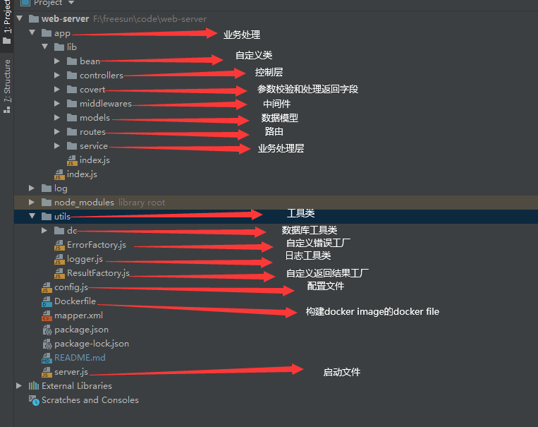

# web-koa2
A web side framework based on KOA2


## 项目架构




## app

### router的编写

1. router

   ```javascript
   ----------------------------
   module.exports = function (app, router, opts) {
   
       const user = require('../../controllers/user/index')(app.fs.dc);
       const covert = require('../../covert/user/index');
   
       router.post('/login', covert.login, user.login);
   
       router.get('/user', user.findUserById);
   
   }
   ------------------------------
   
   每一个router 可以传递2个处理方法， 一个是covert的方法，用来校验参数和构建res， 一个是controller的方法，用来处理逻辑
   
   ```

   

2. covert

   ```javascript
   -----------------------
   const validator = require('validator');
   
   module.exports =  {
   
       login: (ctx, next) => {
          //......
       }
   
   }
   -------------------------------------------
   // 引进validator包用来作参数校验
   ```

   

3. controller

   ```javascript
   ------------------------------
   const request = require("superagent");
   module.exports = function (dc) {
       const userService = require('../../service/user')(dc.models)
       let res = {};
       res.login = async (ctx, next) => {
           // ................
       }
   
       res.findUserById = async (ctx, next) => {
   		// .................
       }
   
       return res;
   }
   
   -----------------------------
   ```

   

4. service

   ```javascript
   ----------------------------------------
   module.exports = function (models) {
       const User = models.User;
       let services = {};
   
   
       services.getCurrentUser = (ctx) => {
           let userId = ctx.session.user ? ctx.session.user.userId : -1;
           return  User.findOne({
               where: {
                   id: userId
               }
           })
       }
   
      // .........................
   
   
   
       return services;
   }
   
   -----------------------------
   
   
   
   // 封装和数据库有关的操作
   
   
   ```

   

5. models

   ```javascript
   --------------------------------------
   module.exports = function (dc) {
       const User = dc.orm.define('user',
           {
               id: {
                   field: 'id',
                   type: dc.ORM.INTEGER,
                   primaryKey: true,
                   autoIncrement: true,
               },
               name: {
                   field: 'username',
                   type: dc.ORM.STRING,
   
               },
               phone: {
                   field: 'password',
                   type: dc.ORM.STRING,
               },
           }, {
               tableName: 'login_user'
           });
   
       dc.models.User = User;
       return User;
   };
   ----------------------------------
       
       // 创建模型
   ```

### middlewares

```javascript
-----------
const MiddlewareBean = require('../bean/middlewareBean');


function factory(app, opts){
    async function init(ctx, next) {
        ctx.fs.errorFactory = app.fs.errorFactory
        ctx.fs.resultFactory = app.fs.resultFactory
        await next();
    }
    return new MiddlewareBean(init, 0);
}

module.exports = factory    
----------

return 一个MiddlewareBean， 第一个参数是处理方法，第二个参数index，代表中间件的加载顺序，index越小越先加载
```


## utils

### dc

```javascript
生成 app.fs.dc 和 ctx.fs.dc

{
    orm：sequlize 实例
    ORM: sequlize 包
    models: 模型
    queryDao： 原生查询方法
}

--------------------
    关于queryDao

	新加一个原生查询的方法：
    1. 在mapper.xml 上编写sql语句
    
    <select id="findUserById">
        SELECT * from login_user where id = :id
    </select>
	// :id 代表传入的参数
    2. 使用
    ctx.fs.dc.queryDao.findUserById.query({
        id: 1
    })

```

### ErrorFactory

```js
生成 app.fs.errorFactory 

-----------
有4中类型的错误
1. parameterError 请求参数的错误

2. permissionError 权限错误

3. logicalError 业务逻辑错误

4. databaseError 数据库错误

```

### ResultFactory

```
生成 app.fs.resultFactory

---------------------
1. buildSucceedResult  成功的响应

2. buildFailResult  错误的响应

```


### logger

```
生成 app.fs.logger 和 ctx.fs.logger

```


